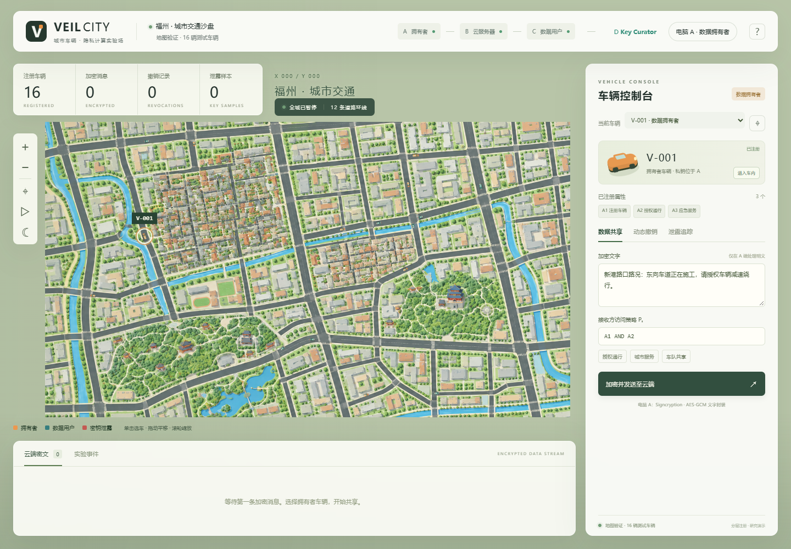

# 新地图与车辆路线

地图来自用户提供的 `Pastel Canal City Map.png`，已原样复制到 `web/assets/pastel-canal-city-map.png`，尺寸 **1672×941**。SHA-256：`ae17034b238d0353faabc1871a5c3102a0e3510deefb2c595e3b0a54db7b5160`。

## 行驶方式

- `web/city-map.js` 保存与图片像素对应的道路节点、弯道路段、双向车道和 12 条闭合路线。范围覆盖西北沿河、北侧住宅、西部街区、中北街区、东北沿河、东北住宅、东侧街区、中央跨河、东部公园、西南公园、南部街区、东南沿河。
- 优先使用图中的机动车道路和桥面；保留弯道中间点，绕开密集建筑、公园内部步道和运河。背景是风格化插画，路线使用图片坐标。
- 前 12 个车辆 ID 分别对应 12 条路线，并交错分配到相距较远的区域。后续车辆在正反车道间交替，使用分散的起点；同一路线同方向的车辆速度一致，减少追赶聚集。
- 路线采用预计算长度和小半径转弯过渡，闭环连接处连续；车辆图标缩小至适合图中道路的尺寸。
- **车辆总数仍由 D 注册决定。** 不会自动创建车辆、身份或密钥。容量、注册信息和云端密文不会因换图改变。少量注册车无法同时覆盖全部区域；16 辆可以覆盖全部 12 条路线，算法也验证了 128 个 ID。
- 车辆位置仅取决于固定 ID 与 B 的统一仿真时钟。重新打开页面、切换 A/B/C/D、轮询或增加车辆不会改变已存在车辆的路线。

## 显示和交互

`web/city.js` 将背景绘制为一张有限地图，按可用窗口等比例适配；地图外留背景色，不重复铺贴。拖动、缩放、复位、昼夜、角色筛选、单车跟随继续使用原交互。A/C 的人物分配规则保持不变。

`Main.java` 补充 PNG、WebP、JPEG 的响应类型，并保留 `nosniff`；已重新编译 `dist/rabe-city.jar`。Windows `build.bat` 的源文件清单改用相对路径和正斜杠，避免 javac 将反斜杠当作转义。

更新生效需重启原 Java 节点，再在浏览器按 **Ctrl+F5**。部署到多台电脑时同步完整的 `web/` 和 `dist/rabe-city.jar`，继续使用各机原配置与运行数据。

若本机尚未把已安装的 JDK 加入 PATH，可在项目根目录的 PowerShell 中为当前终端设置后启动：

```powershell
$env:Path = (Resolve-Path '..\..\tools\jdk17\extract\jdk-17.0.20.1+1\bin').Path + ';' + $env:Path
.\start-local.bat
```

## 验证

```sh
node --test tests/city-map.test.cjs
```

8 项通过：闭环、所有 128 个 ID 的边界、12 条路线分配、位置独立性、闭环接缝连续、正反车道分离、起点间距和合理速度。

`tests/city-browser-check.cjs` 使用 Playwright/Chrome。静态 HTML/JS/CSS/PNG 由本机 Java JAR 实际提供；浏览器内拦截 API，注入 16 辆测试车，**不提交注册或修改后端数据**。通过 `CITY_TEST_URL` 指定测试服务，默认 `http://127.0.0.1:8891`；可用 `PLAYWRIGHT_MODULE` 和 `BROWSER_EXECUTABLE` 指定现有依赖。

本次浏览器验证通过：PNG 响应头与原图字节一致，四种角色相同时间的位置一致，A/C 点击选车、唯一车内窗口、固定人物、行驶/暂停、昼夜、桌面与手机等比例适配，无 JavaScript 页面异常。测试报告在 `map-browser-report.json`，测试画面见下图。这些测试针对地图和交互，不是重新进行密码算法压力测试。


