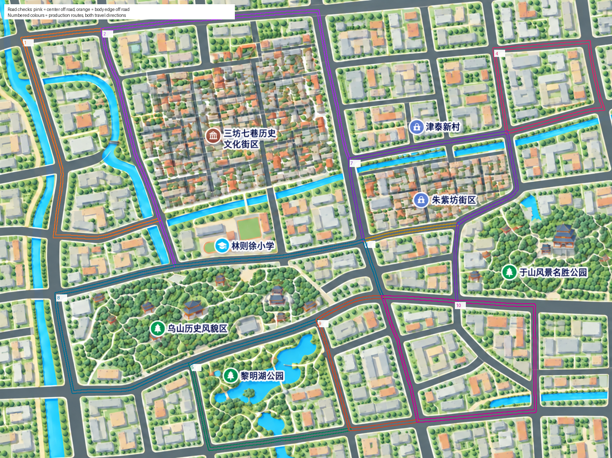

# 福州地标地图与车辆路线

使用本次提供的带地标地图，原样保存为 `web/assets/fuzhou-landmark-map.png`，尺寸 **1449×1086**。SHA-256：`9c7d3ffecbc7f4479818efd1b1847b7348885ed936209dd38fd2a1c602e5fca9`。图片未裁切、拉伸或改画；旧图保留在 `web/assets/pastel-canal-city-map.png` 供对照。

## 路线调整

新图比旧图减少了右侧范围、增加了南部街区，不能仅将旧坐标按画布宽高缩放。已重新校准道路中心和双向车道，避开三坊七巷内部窄巷、津泰新村标注覆盖的小路以及地图外道路，补充黎明湖与南部住宅路线。

`web/city-map.js` 定义 **10 条闭合路线**：西北沿河、三坊七巷外围、乌山于山连接、东北住宅、黎明湖公园、中央跨河、于山与朱紫坊、西南公园、南部住宅、东南沿河。路线使用插画像素坐标，不代表真实导航数据。

- 前 10 辆已注册车辆分散到全部路线；后续车辆交替分配正反车道，并使用分散起点。同一路线同方向采用相同速度，减少追赶聚集。
- 显示用车身按 `CityMap.vehicleScale` 适配道路宽度；选中标记与点击范围不随车身缩小。图面校验读取同一个比例，检查最大车身的保守矩形包络。
- 车辆位置由固定 ID 和 B 的统一仿真时钟决定，刷新页面、轮询或增加车辆不会重新随机分配路线。驾驶员形象仍按车辆固定。
- **车辆数量由 D 注册决定**，更换地图不自动注册车辆，也不重置车辆、密钥或云端密文。

## 显示与更新

默认在顶部栏、统计区、工具栏、右侧控制台和底部面板之间，等比例最大化显示完整地图，不裁切、不拉伸、不重复铺贴。拖动、缩放、重置、昼夜、筛选及 A/C 单车跟随继续可用；重置按钮恢复全图。

地图图片、道路定义和地图渲染器已从 `rabe-city-local/rabe-city` 同步。后续界面修改仅在 repository 进行：D 纳入 A/B/C 同款节点卡片，并统一显示“密钥管理者”；删除地图标题卡及独立时钟提示；坐标移至顶部栏；底部图例添加不透明背景。全局时钟、车辆暂停和车内跟随继续正常工作，注册表单、中文属性字典及车辆重新加入功能保持可用。

本次只修改前端资源，无需重新编译 JAR。正在运行项目时，在各页面按 **Ctrl+F5**。多机部署需同步完整 `web/`，继续使用各机原配置和运行数据。

## 验证方式

运行路线逻辑回归：

```sh
node --test tests/city-map.test.cjs
```

覆盖 128 个车辆 ID 的边界、10 条路线分配、位置独立性、闭环接缝连续、正反车道分离、起点间距和运动速度。

运行图面贴合检查（需要 Python、Pillow、NumPy 和 Node）：

```sh
python tests/check-route-surface.py --node /path/to/node --step 0.5
```

脚本读取生产图片和全部双向路线，每不超过 2 个原图像素采样一次，并检查车中心与最大车身包络的 37 个探针。逐像素确认处于灰色铺装道路内；三处经放大原图复核的蓝灰桥面/道路反光使用局部颜色分类，位置和颜色范围均写入报告，水面与白色路缘不豁免。报告记录图片、路线文件哈希，确保能复核具体版本。产物为 `build/map-check/route-surface/report.json`、`road-mask.png` 和 `route-overlay.png`。

本次迁移验证：8 项路线逻辑测试通过；按 0.5 像素间距检查 50,603 个车辆位置，中心出路、车身压边、越界均为 0。四端浏览器回归通过，并保留、验证了团队新增的中文属性注册、50 项属性字典和车辆重新加入。

这是针对该插画的道路贴合检查；车辆在不同路线的交叉口尚无交通信号或相互避让模拟。

`tests/city-browser-check.cjs` 通过真实 Java 服务读取静态资源，在隔离浏览器内注入 16 辆测试车，不提交注册或改写后端数据。检查四端同时间坐标、A/C 点击进入唯一车内窗口、固定驾驶员、行驶/暂停、昼夜、1440×1000 桌面和 390×844 手机尺寸的全图显示，以及 JavaScript 异常。测试服务默认 `http://127.0.0.1:8891`，可通过 `CITY_TEST_URL`、`PLAYWRIGHT_MODULE` 和 `BROWSER_EXECUTABLE` 指定环境。

浏览器结果见 [map-browser-report.json](map-browser-report.json)，图面结果见 [map-route-surface-report.json](map-route-surface-report.json)。




本轮界面验证另覆盖 12 组桌面、手机及短屏尺寸，顶栏无横向溢出，图例无面板重叠。结果见 [ui-layout-report.json](ui-layout-report.json)。
