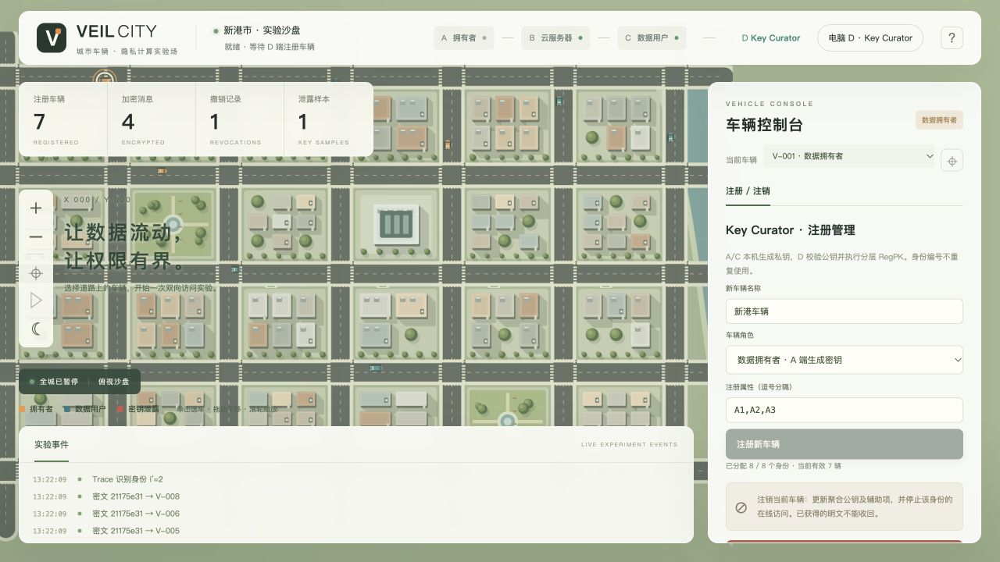

# 本次修改的验证报告

验证日期：2026-10-05。环境：macOS arm64，Temurin OpenJDK 1.8.0_492；四个独立 Java 进程通过本机 HTTP 通信。

## 自动回归

运行项目 `tests/integration.py`，使用全新配置和运行目录，8 个累计注册身份、5 个属性，4 层（1/2/4/8 槽位）。结果：**212 个接口及结果断言全部通过**。

原始输出见 [test-results.json](test-results.json)。断言数包括状态码、结果比较和重复验证，不代表 212 种独立实验场景。

| 检查项 | 已验证结果 |
|---|---|
| 动态注册 | 从 0 开始，由 D 授权、A/C 本机生成私钥、公钥经 D 校验后生效；不需要满额注册 |
| 第 6 节状态 | 在 ctr=5 检查 latest 的完成块、D1 部分覆写、D2 仅向完成块成员发放辅助项 |
| 拒绝无效注册 | 未授权角色、错误节点令牌、过期 ctr、错误交叉项被拒绝，ctr 不前进 |
| 注册队列 | C 离线时任务保留，C 恢复后正常完成 |
| 历史访问 | 老车辆可访问其有权访问的旧消息；后注册车辆不能访问注册前密文 |
| 双向策略 | 双方满足、仅发送方满足、仅接收方满足、双方均不满足；覆盖 AND 和 OR |
| 跨层数据 | 发送方不属于接收方最新小层块时，独立发送证明与正向密文仍正确工作 |
| 本地明文 | 全局 state 没有明文；指定车辆收件箱只包含自己的记录；其他角色的收件箱访问被拒绝 |
| 指定密文撤销 | 撤销目标的实际本地 AES-GCM 解密失败；同块其他合法车辆和其他层合法车辆可继续解密 |
| D 注销 | 不回收身份计数器；已注销用户在线请求被拒绝；继续注册填满大层不会恢复其资格 |
| 追踪 | 从真实本机私钥复制的样本定位全局身份；注销后仍可追踪 |
| D 角色限制 | D 无发送、解密、追踪、泄露、指定密文撤销和全城暂停权限；A/B/C 无注册/注销权限 |
| 时钟一致 | 四端暂停时 elapsed 完全相等；继续后均读取 B 时钟 |
| 持久化 | 四个进程全部停止重启，ctr、注销状态、私钥、密文、各车收件箱及暂停时钟恢复 |
| 容量 | 第 9 个注册申请被 8 身份测试容量拒绝，注销不会偷偷复用编号 |
| 私钥范围 | D 的注册记录不含 r/q/z 私钥字段 |

其中连续执行了 12 轮额外的加密和双接收车辆解密回归，不等同于原先要求的 1000 次压力测试。

## 独立算法检查

`tests/CryptoChecks.java` 输出 **CRYPTO_CHECKS_PASSED=8265**，见 [crypto-tests.log](crypto-tests.log)。包括：

- **8,256 个** `(ctr_ct, ctr_sk)` 组合：枚举 ctr=1…128，检查 MSB 路由确实落在包含该用户的最新已完成块。
- **9 个**额外检查：未注册身份拒绝；直接绕过 HTTP 状态检查，验证原 `Deregister` 对目标/非目标的真实代数影响；旧密文+旧辅助项仍可解密的明确边界；合法/损坏公钥；单槽位层单位元的序列化和发送证明验证。

这里的 8,256 项主要是路由边界检查，不是 8,256 次完整密码运算或压力循环。

## 浏览器检查

使用 A/B/C/D 四个实际网页检查：

- D 控制台只显示注册/注销管理，保留城市地图。
- C 选择 V-005，显示该车成功解密的文字；切到未解密的 V-003 后显示空收件箱，结果栏清空。
- 点击解密后再切车，未在另一辆车显示先前明文；前端请求版本校验也用于拒绝迟到结果。
- 保留原新版男女驾驶员车内视角；本端车辆可进入，其他端车辆不能进入。
- 四端选择 V-005，暂停时读取实际 Canvas 状态，均为：
  - 仿真时间：`112.249` 秒
  - 世界坐标：`x=1655`，`y=245.11399999999958`
  - 朝向：`1.5707963267948966`
- C 浏览器检查时没有控制台 error 日志。

坐标证据：[ui-motion-check.json](ui-motion-check.json)。

### D 注册管理界面

### C 车辆专属收件箱

## 范围说明

本次验证针对新增注册、注销权限、明文隔离和时钟同步，以及被改动影响的原功能。**没有重新执行 100 辆/1000 次循环/100 次撤销等全套性能验收，也没有在四台物理电脑上实测局域网延迟。** Windows 启动脚本已提供，但本次运行环境是 macOS。

第 6 节是注册编译方法，不能把这些功能测试当作整个混合双向方案的安全证明。原发送方认证问题、旧副本撤销边界及工程适配分别见 [SECURITY_FINDINGS.md](SECURITY_FINDINGS.md) 和 [REGISTRATION.md](REGISTRATION.md)。
